# Chapter 3 Diagram Conversions (Mermaid format)

Below are the modernized, preview-able Mermaid diagram versions of the text/ASCII diagrams from Chapter 3 of your Minor Project Report. You can view these directly in your Markdown previewer, or copy-paste them back into your main report file.

### 3.1 System Architecture

**High-Level Architecture**
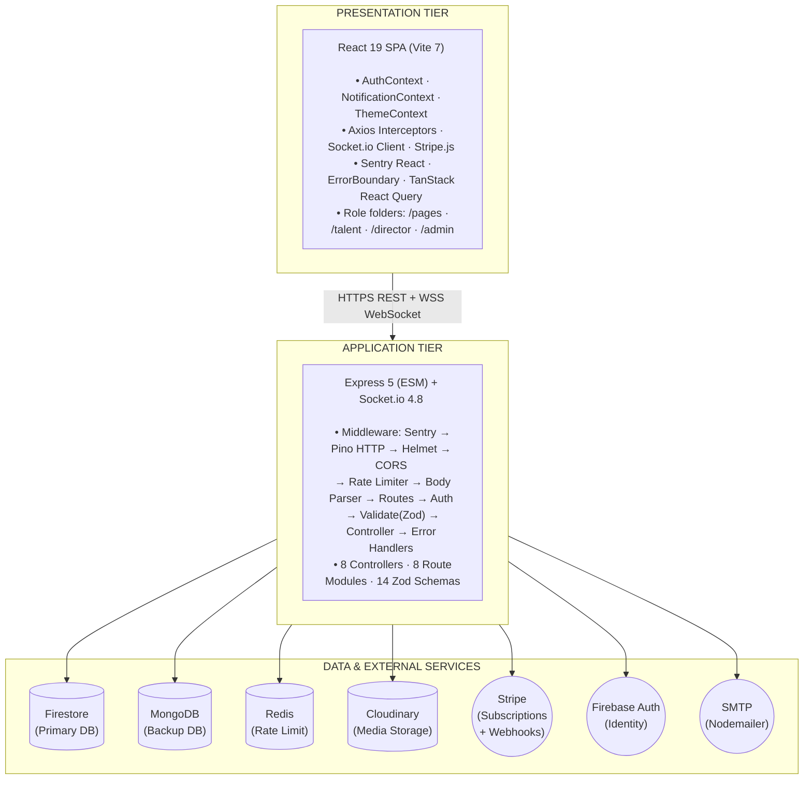

### 3.3 Data Flow Diagrams

**Level 0 DFD — Context Diagram**
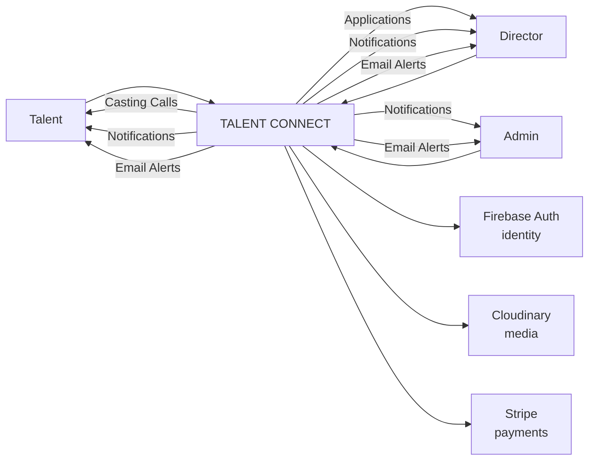

**Level 1 DFD — Authentication and Registration Flow**
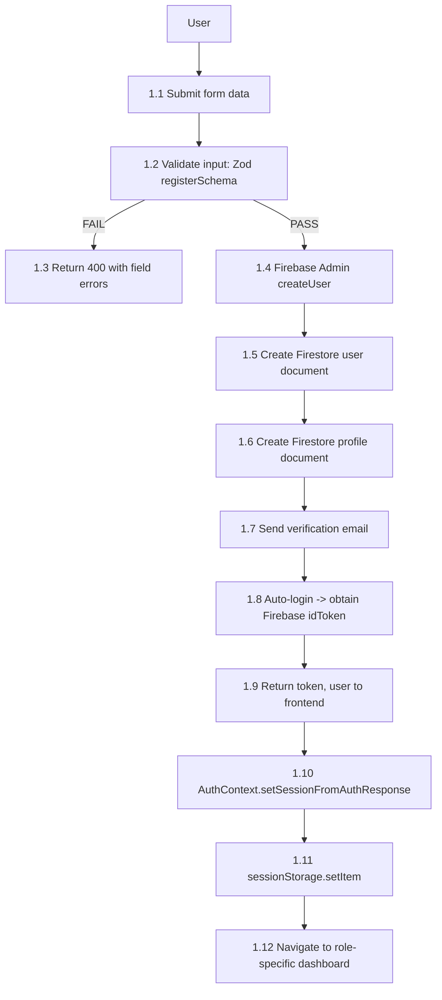

**Level 1 DFD — Casting Pipeline Flow**
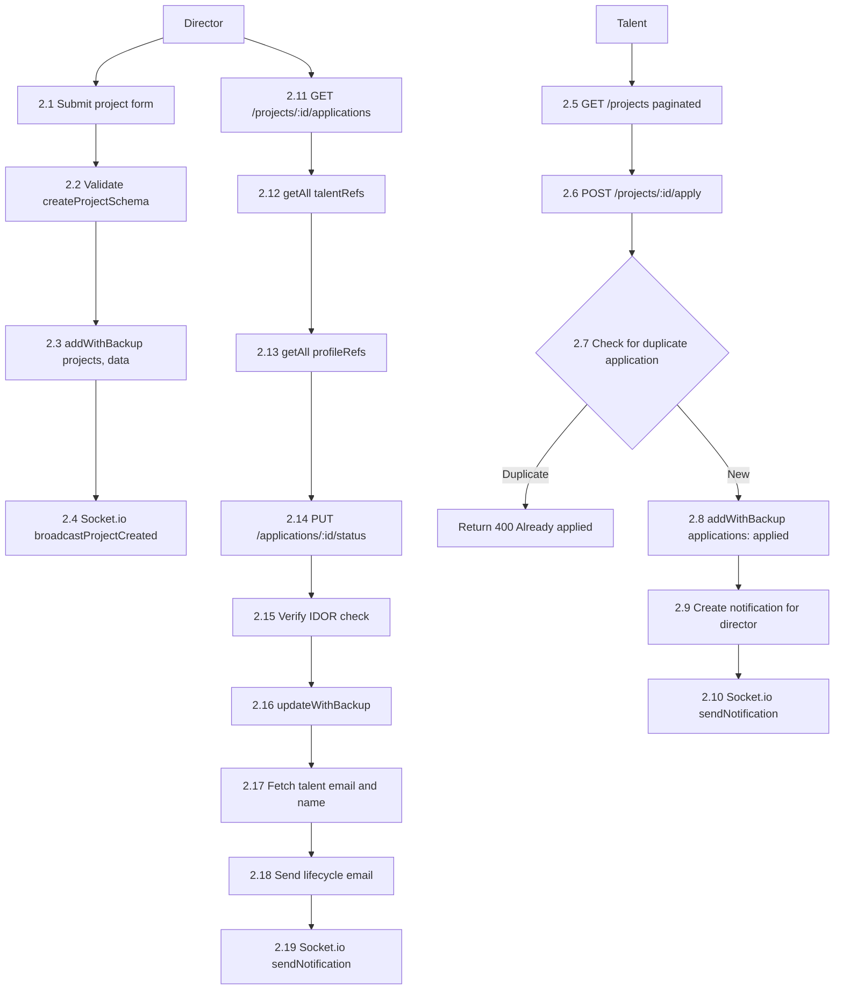

**Level 1 DFD — Payment Flow**
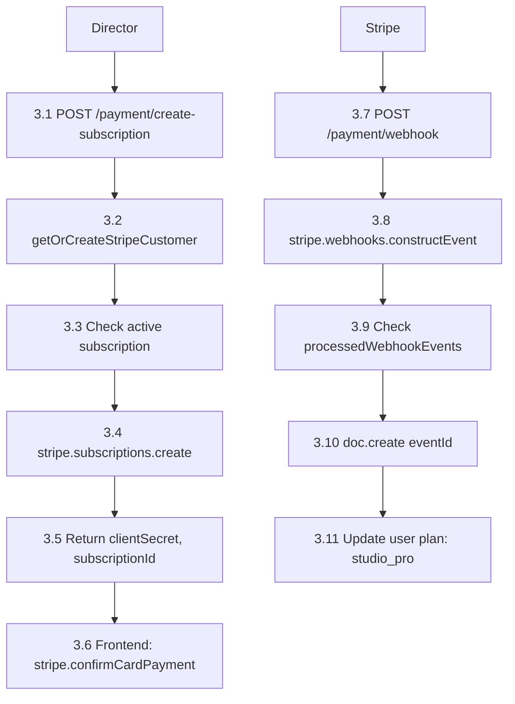

### 3.4 Activity Diagrams

**Activity Diagram — Talent Registration and Verification**
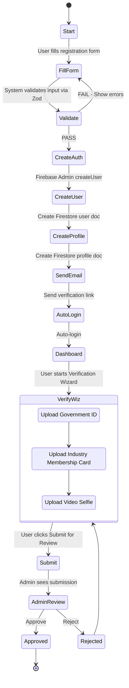

**Activity Diagram — Director Project Creation and Application Pipeline**
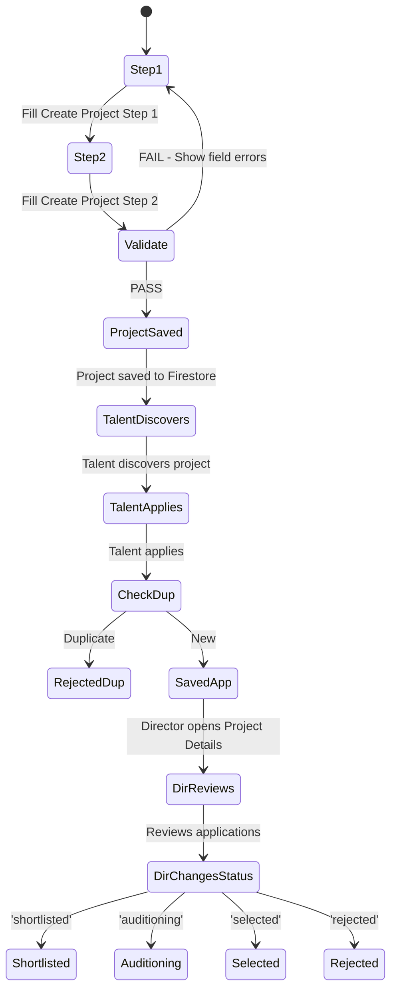

### 3.5 Entity Relationship Diagram
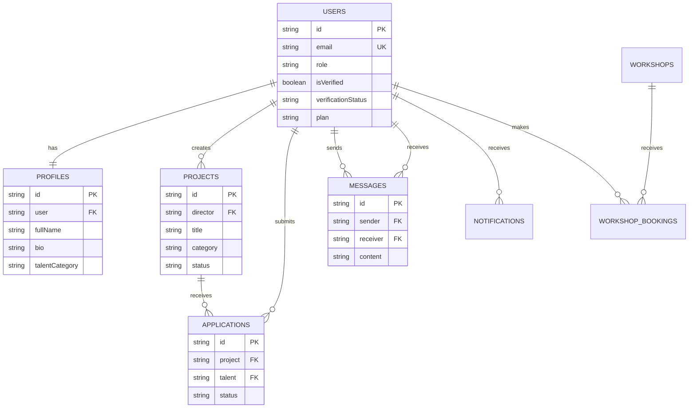

### 3.6 Sequence Diagrams

**Sequence Diagram — User Registration**
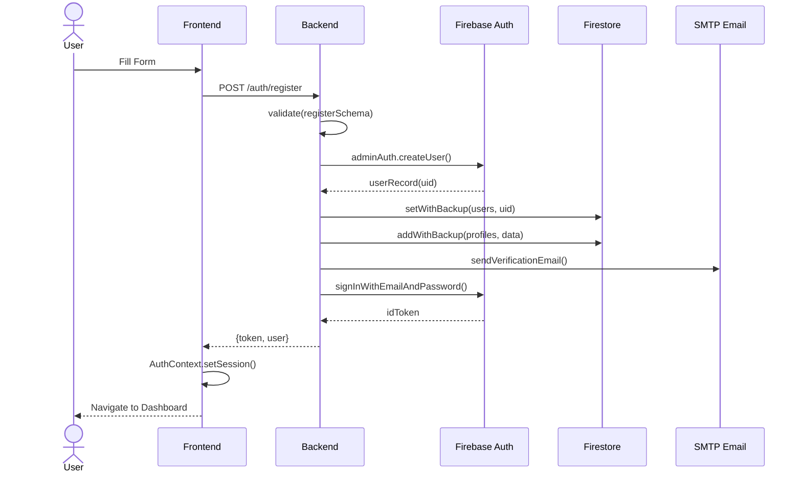

**Sequence Diagram — Stripe Subscription Payment**
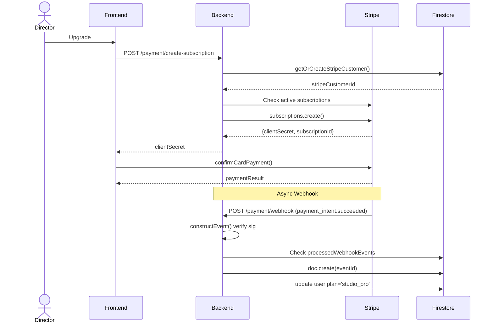

**Sequence Diagram — Real-Time Messaging**
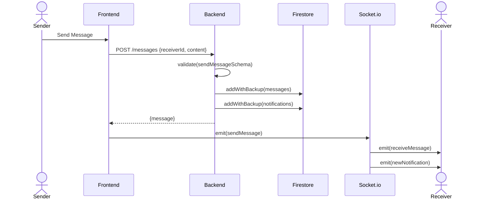
