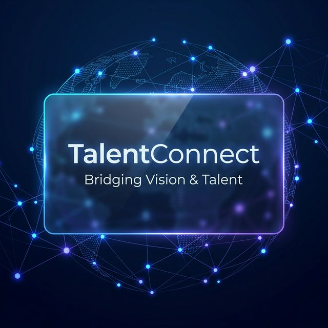
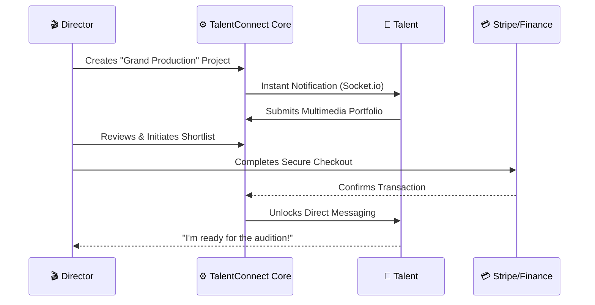

This <p align="center">
  
</p>

<h1 align="center">✨ TalentConnect ✨</h1>

<p align="center">
  <b>The Enterprise-Grade Ecosystem Bridging Visionary Directors & Exceptional Talent.</b>
</p>

<p align="center">
  <a href="https://nodejs.org/"></a>
  <a href="https://react.dev/"></a>
  <a href="https://www.mongodb.com/"></a>
  <a href="https://www.docker.com/"></a>
</p>

---

## 💎 The Vision

> [!IMPORTANT]
> **TalentConnect** isn't just a job board; it's a high-performance engine for the creative industry. By integrating real-time communication, secure financial layers, and AI-ready verification flows, we've built a platform where the next big production starts today.

---

## 🚀 The Ecosystem Flow

Understand how **TalentConnect** orchestrates the connection between creativity and opportunity.



---

## ⚡ Engineered for Excellence

### 🏗️ Scalable Architecture
- **Real-time Engine**: Powered by **Socket.io** for sub-100ms latency in messaging and alerts.
- **Media Optimization**: Seamless integration with **Cloudinary** for high-fidelity asset management.
- **Security First**: Implementation of **Helmet**, **CORS**, and **Rate Limiting** to ensure 99.9% resilience against common vulnerabilities.

### 💰 Business Readiness
- **Monetization Layer**: Production-ready **Stripe** integration for recurring subscriptions and project-based fees.
- **Multi-Lingual Reach**: Global ready with `i18next` support for diverse creative markets.
- **Admin Command Center**: Advanced RBAC (Role-Based Access Control) for system-wide governance.

---

## 🛠️ Technology Showcase

| Tech | Purpose | Innovation Level |
| :--- | :--- | :--- |
| **React 19** | Ultra-smooth UI/UX | 🚀 Cutting Edge |
| **Express 5.x** | High-concurrency API | 🛡️ Robust |
| **MongoDB 9.x** | Flexible Data Modeling | 📊 Scalable |
| **Vite** | Lightning-fast Build | ⚡ Optimized |
| **Zod** | Type-safe Validation | ✅ Accurate |

---

## 🚥 Quick Start & Deployment

### 🐳 The One-Command Experience
Forget complex configuration. Spin up the entire environment (Web, API, DB) in seconds:
```bash
docker-compose up -d --build
```

### 👨‍💻 Manual Spin-up
1. **Core API**: `cd server && npm install && npm run dev`
2. **Web Interface**: `cd client && npm install && npm run dev`

*Requires environment variables from `.env.example` in both directories.*

---

## 🛡️ Stability & Performance
- **Compression**: Gzip/Brotli enabled for minimal payload delivery.
- **Morgan**: Detailed audit logs for every transaction.
- **TanStack Query**: Intelligent caching layer for zero-redundancy data fetching.

---

## 👥 Meet the Architects
**Lakshya Hidau** • **Vishal Jain** • **Shyamal Sheorey**

[](https://github.com/vjtalentconnect-lab/talentconnect)

---
<p align="center">
  <i>Propelling the future of talent discovery.</i>
</p>
